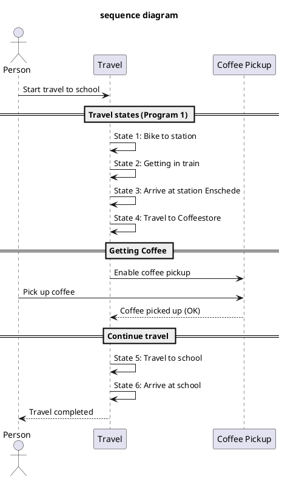

# Sequence diagram

For the overal system there has been made a sequence diagram.
As seen in sequence diagram below there are 2 systems.
1 system called traveling and 1 system called Coffee.

The sequence diagram:
