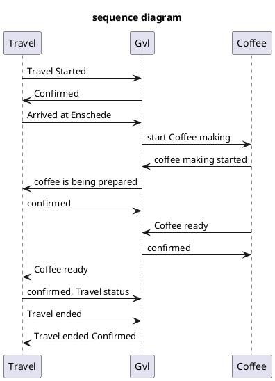

# Sequence diagram

```plantuml

@startuml

title sequence diagram

Travel -> Gvl : Travel Started
Gvl -> Travel  : Confirmed

Travel -> Gvl : Arrived at Enschede
Gvl -> Coffee : start Coffee making

Coffee-> Gvl : coffee making started


Gvl -> Travel : coffee is being prepared
Travel -> Gvl : confirmed

Coffee -> Gvl : Coffee ready
Gvl -> Coffee : confirmed
Gvl -> Travel : Coffee ready
Travel -> Gvl : confirmed, Travel status

Travel -> Gvl : Travel ended
Gvl -> Travel: Travel ended Confirmed

@enduml
```
