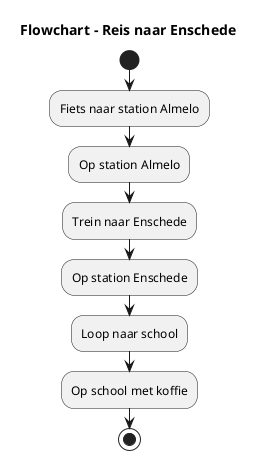

# Program_1: Travel to school

This program is about how to travel from home to school.
But no day can start without a good morning coffee!
So before this program can finish, first it needs something from "program 2". COFFEE!!
