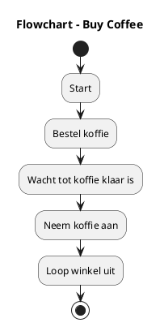

# Program_2: Buying coffee

The second program is about taking coffee from a coffestore.
The coffee is being prepared during the traveling.
When "Program 1" is at the 5th state, arrived in Enschede.

The coffee is picked up and only then the travel state can go on.
